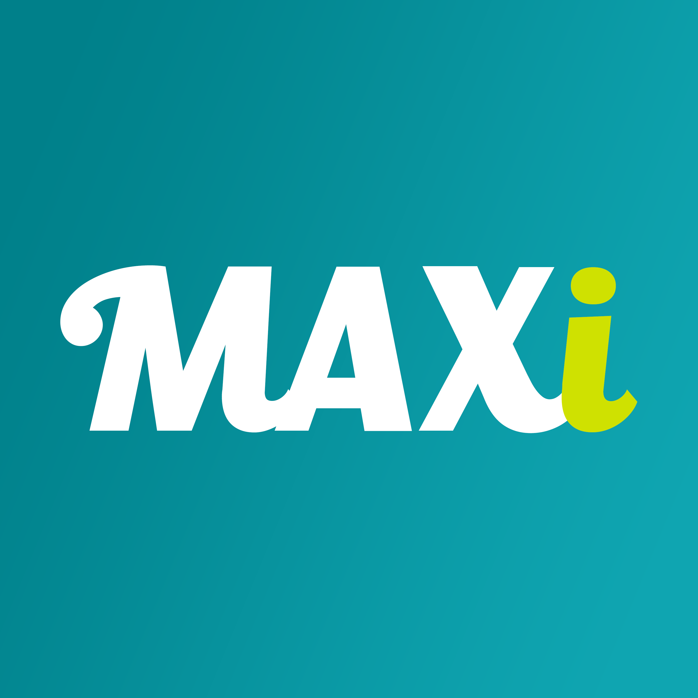

<br />
<p align="center">
  <a href="https://encodepassword.com">
    
  </a>

  <h3 align="center">MAXiBOT</h3>

  <p align="center">
    Bot discord qui sert à récupérer les offres TGV Max disponibles entre deux destinations via API de la SCNF
    <br />
    Le projet est basé sur 
    <a href="https://www.python.org/">
    Python </a> .
    <br />
  </p>
  <p align="center">
    <a href="https://github.com/AMINE1921/MAXiBOT"> </a>
    <a href="https://discord.gg/SRC5cmKaVr"> </a>
  </p>
</p>
<br />
<br />

## Technologie et Principe

Technologie utilisée: Python

Avant d'utiliser le script il est obligatoire de mettre la clé du bot discord (BOT_KEY) dans un fichier d'environnement (.env)

## Utilisation

```
python3 tgv_max.py
```
